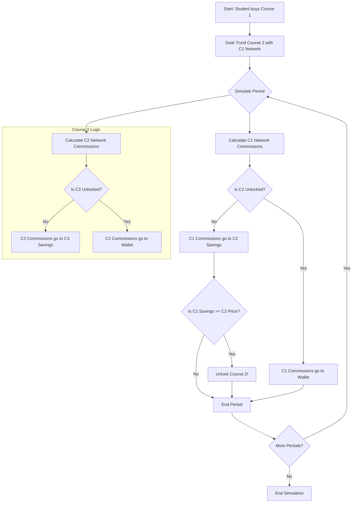

# Student Journey: The "Cascading Release" Model

This document outlines the journey of a hypothetical student, Alex, as simulated by the application's "Cascading Release" model. In this model, each course's network funds the next course, and once that goal is met, its earnings are "released" to the student's wallet.

**Persona:** Alex, a student starting his journey on the platform. The app simulates his path from initial investment to becoming a top earner.

---

## The Simulated Journey

### Step 1: The Initial Setup & First Goal

Alex's journey begins by purchasing "Course 1" for $15. The calculator user sees this as the starting point. The application immediately calculates Alex's first objective:

*   **Action:** Alex enrolls in Course 1.
*   **App Simulation:** The dashboard for "Course 1" becomes active.
*   **Primary Goal:** The system sets a target to fund "Course 2," which costs $100.
*   **Reserve Rule:** All commissions generated by his **Course 1 network** are reserved in savings to meet this $100 goal.

### Step 2: Building the First Network

The time simulation projects Alex's progress.

*   **Week 1:** Alex's Course 1 network grows. He earns a commission (e.g., $6.75).
*   **App Simulation:** The table shows `$6.75` added to his **Course 2 Savings**. His wallet remains at `$0`.
*   **Week 2-4:** This continues. All earnings from the Course 1 network are channeled into savings for Course 2.

### Step 3: Graduation and The "Cascading Release"

A critical event occurs in the simulation.

*   **Action:** Alex's Course 1 network generates enough commission to meet the $100 goal for Course 2.
*   **App Simulation:**
    1.  Course 2 is automatically unlocked for Alex.
    2.  **The Cascade:** The purpose of the Course 1 network is now fulfilled. All *future* commissions from the Course 1 network are now released directly to Alex's wallet.
    3.  **The New Goal:** A new, separate savings goal is created. All commissions from his new **Course 2 network** will now be reserved to fund Course 3.

### Step 4: Earning from Multiple Streams

The simulation now shows Alex earning from two distinct streams.

*   **Wallet Earnings:** His ever-growing Course 1 network continues to generate commissions, which now go straight to his wallet.
*   **Savings Earnings:** His new Course 2 network starts to grow, and its commissions are saved to unlock Course 3.

This cycle repeats. Once Course 3 is unlocked, commissions from the Course 2 network are also released to his wallet, and the Course 3 network begins funding Course 4. Alex's wallet income grows exponentially as each new course network is "released."

---

## Student Journey Flowchart (Simulated)



```

<!--
[PROMPT_SUGGESTION]Refactor the `calculateNetworkLevels` function to be more pure and easier to test.[/PROMPT_SUGGESTION]
[PROMPT_SUGGESTION]Based on the UI, create a new component for the settings panel to separate concerns.[/PROMPT_SUGGESTION]
